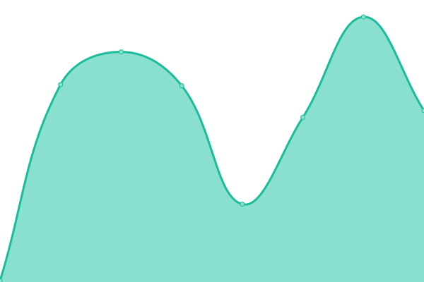

# [📈 Live Status](https://Neutx.github.io/Upptime-Test): <!--live status--> **🟧 Partial outage**

This repository contains the open-source uptime monitor and status page for [Adil Parwez](adilparwez.me), powered by [Upptime](https://github.com/upptime/upptime).

With [Upptime](https://upptime.js.org), you can get your own unlimited and free uptime monitor and status page, powered entirely by a GitHub repository. We use [Issues](https://github.com/Neutx/Upptime-Test/issues) as incident reports, [Actions](https://github.com/Neutx/Upptime-Test/actions) as uptime monitors, and [Pages](https://Neutx.github.io/Upptime-Test) for the status page.

<!--start: status pages-->
<!-- This summary is generated by Upptime (https://github.com/upptime/upptime) -->
<!-- Do not edit this manually, your changes will be overwritten -->
<!-- prettier-ignore -->
| URL | Status | History | Response Time | Uptime |
| --- | ------ | ------- | ------------- | ------ |
|  [Portfolio](https://www.adilparwez.me) | 🟩 Up | [portfolio.yml](https://github.com/Neutx/Upptime-Test/commits/HEAD/history/portfolio.yml) | 

 239ms
     
 | 

<a href="https://Neutx.github.io/Upptime-Test/history/portfolio">100.00%</a>
    

|  [Delius Internship](https://www.delius.in) | 🟥 Down | [delius-internship.yml](https://github.com/Neutx/Upptime-Test/commits/HEAD/history/delius-internship.yml) | 

 922ms
     
 | 

<a href="https://Neutx.github.io/Upptime-Test/history/delius-internship">100.00%</a>
    

|  [Kreo](https://kreo-tech.com) | 🟩 Up | [kreo.yml](https://github.com/Neutx/Upptime-Test/commits/HEAD/history/kreo.yml) | 

 478ms
     
 | 

<a href="https://Neutx.github.io/Upptime-Test/history/kreo">100.00%</a>
    

|  [How India Games](https://howindiagames.kreo-tech.com) | 🟩 Up | [how-india-games.yml](https://github.com/Neutx/Upptime-Test/commits/HEAD/history/how-india-games.yml) | 

 167ms
     
 | 

<a href="https://Neutx.github.io/Upptime-Test/history/how-india-games">100.00%</a>
    

|  [Fastest Fingers First](https://fastestfingers.kreo-tech.com) | 🟩 Up | [fastest-fingers-first.yml](https://github.com/Neutx/Upptime-Test/commits/HEAD/history/fastest-fingers-first.yml) | 

 185ms
     
 | 

<a href="https://Neutx.github.io/Upptime-Test/history/fastest-fingers-first">100.00%</a>
    

<!--end: status pages-->

[**Visit our status website →**](https://Neutx.github.io/Upptime-Test)

## 📄 License

- Powered by: [Upptime](https://github.com/upptime/upptime)
- Code: [MIT](./LICENSE) © [Anand Chowdhary](https://anandchowdhary.com), supported by [Pabio](https://pabio.com)
- Data in the `./history` directory: [Open Database License](https://opendatacommons.org/licenses/odbl/1-0/)
